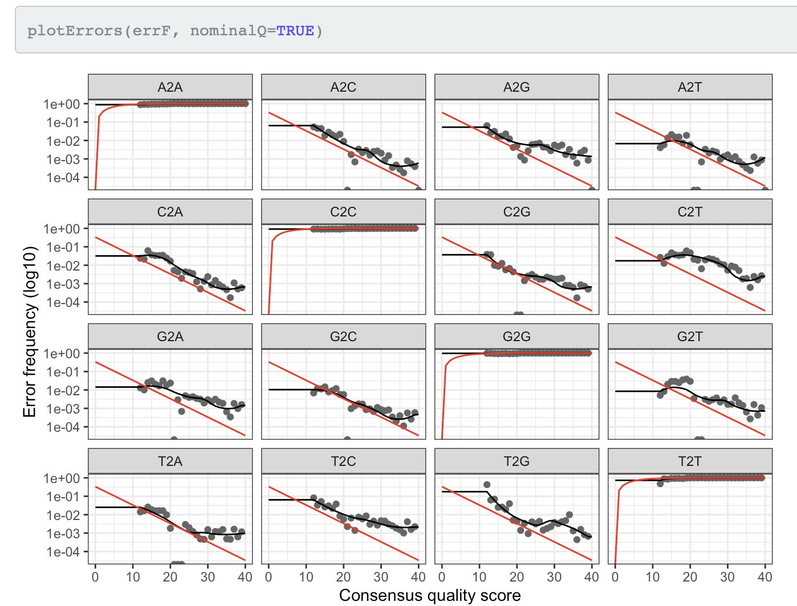

Este es el pipeline seguido para el análisis de los metagenomas de
amplicones de ITS del trabajo de Daniella Senatore, utilizando dada2.
Para correrlo se requieren los paquetes dada2, ShortRead y phyloseq, así
como también Qiime2. Para instalar Qiime2 podemos consultar el tutorial
disponible en
<a href="https://docs.qiime2.org/2020.11/install/" class="uri">https://docs.qiime2.org/2020.11/install/</a>

Pasos previos
=============

dada2 requiere que los archivos que contienen las secuencias sean
previamente desmultiplexadas. Para esto, hay diferentes opciones
disponibles. Yo utilicé Qiime2, siguiendo los siguientes pasos (se asume
que Qiime2 está instalado y accesible):

Pasos previos en la línea de comandos, utilizando Qiime
-------------------------------------------------------

### Comprimir el archivo fastq.

Antes de importar las secuencias a Qiime debemos comprimir el archivo
utilizando el programa `gzip`:

**Requiere:** archivo .fastq multiplexado.

**Se obtiene:** archivo .fastq.gz

``` bash
gzip archivo_fastq_multiplex.fastq
```

### Importar archivo con las secuencias a Qiime2

Dado que utilizaremos Qiime2 para demultiplexar los reads, el primer
paso en el *pipeline* de Qiime es la importación.

**Requiere:** archivo multiplexado.fastq.gz

**Se obtiene:** archivo multiplexado.qza

``` bash
qiime tools import --type MultiplexedSingleEndBarcodeInSequence  --input-path archivo_fastq_multiplex.fastq.gz --output-path multiplexed-seqs.qza
```

**Argumentos del comando:**

`--input-path`: path al archivo que se importa.  
`--output-path`: nombre que se le da al archivo importado. Tiene
extensión qza.  
`--type MultiplexedSingleEndBarcodeInSequence`: indica que el archivo
que se importa es multiplexado, contiene barcodes y contiene reads
single end (SE).

**Output:**

    Saved SampleData[SequencesWithQuality] to: demultiplex_seqs.qza
    Saved MultiplexedSingleEndBarcodeInSequence to: unmatched_barcode.qza

### Demultiplexar.

Este paso se realizó según las instrucciones disponibles en
<a href="https://forum.qiime2.org/t/demultiplexing-and-trimming-adapters-from-reads-with-q2-cutadapt/2313" class="uri">https://forum.qiime2.org/t/demultiplexing-and-trimming-adapters-from-reads-with-q2-cutadapt/2313</a>.

**Paso:** demultiplexar

**Requiere:**

-   archivo *mapping file*: que contiene una tabla con columnas
    separadas por tabulaciones donde se incluyan los nombres de las
    secuencias y los barcodes.  
-   nombre de la columna del mapping file que contiene los barcodes.  
-   path al archivo .qza obtenido en el paso anterior.  
-   el nombre que tendrá el directorio que contendrá los reads
    demultiplexados.

**Se obtiene:** archivos con los reads de cada muestra por separado en el directorio
    especificado.

``` bash
qiime cutadapt demux-single --i-seqs multiplexed-seqs.qza --m-barcodes-file mappingfile.txt --m-barcodes-column BarcodeSequence --o-per-sample-sequences demultiplex_seqs.qza --o-untrimmed-sequences unmatched_barcode.qza --output-dir demultiplex
```

**Argumentos del comando:**

`cutadapt demux-single`: se ejecuta el programa `Cutadapt` para
demultiplexar secuencias SE.  
`--o-untrimmed-sequences`: locación de las secuencias que no matchearon
con ningún barcode.  
`--i-seqs`: nombre del archivo importado (qza), que se generó en el paso
anterior.  
`--m-barcodes-file`: path al *mapping file*.  
`--m-barcodes-column`: nombre de la columna del *mapping file* que
contiene la secuencias de los barcodes.

### Remover los barcodes

Una vez demultiplexados, deben removerse los barcodes de los reads. Para
esto volveremos a utilizar el *plug-in* Cutadapt de Qiime.

**Paso:** remoción de barcodes

**Requiere:** path a las secuencias demultiplexadas del paso anterior

**Se obtiene:** reads multiplexados y trimmeados en archivo .qza

``` bash
qiime cutadapt trim-single --i-demultiplexed-sequences demultiplex_seqs.qza --o-trimmed-sequences trimmed-demult_seqs.qza
```

**Argumentos del comando:**

`cutadapt trim-single`: se ejecuta el programa `Cutadapt` para trimmear
secuencias de adaptadores o barcodes en reads SE.

`--i-demultiplexed-sequences`: archivo .qza que contiene los reads
demultiplexados obtenidos en el paso anterior.

`--o-trimmed-sequences`: nombre del archivo de salida (qza) que contiene
los reads demultiplexados y trimmeados.

### Exportar los reads demultiplexados sin barcodes

Hasta ahora venimos trabajando con Qiime2, por lo tanto todos los
archivos que se generan durante el procesamiento de las muestras está
almacenado en *artefactos*. Para continuar el procesamiento de los datos
en dada2 debemos transformarlos en fastq. Para esto exportamos los datos
contenidos en archivos .qza.

**Paso:** exportar datos de qiime

**Requiere:** archivos a exportar

**Se obtiene:** archivos en formato apropiado para continuar utilizando otro software

``` bash
mkdir demulti
qiime tools extract --input-path  trimmed-demult_seqs.qza --output-path trim-demult
```

**Argumentos**:

`--input-path`: path del archivo qza a exportar

`--output-path`: nombre de la carpeta que contiene los datos exportados

Procesamiento de datos en R utilizando `dada2`
==============================================

En este punto contamos con los reads desmultiplexados y sin barcodes, y
continuaremos su procesamiento en dada2. Si los paquetes necesarios no
están instalados, pueden obtenerse ejecutando:

``` r
if (!requireNamespace("BiocManager", quietly = TRUE))
    install.packages("BiocManager")

BiocManager::install("phyloseq")
BiocManager::install("dada2")
BiocManager::install("ShortRead")

# Librerías auxiliares
library(tidyverse)
```

Una vez instalados los paquetes requeridos se cargan en la sesión de R,
utilizando la función `library()`:

``` r
library(dada2)
library(ShortRead)
library(phyloseq)
```

### Especificar la ubicación de los datos procesados:

En el paso anterior exportamos los datos procesados por Qiime. Ahora
guardamos en una variable llamada `path` la ubicación de los archivos
exportados. En este caso, los archivos se encuenctran en el directorio
`trimm_demult`:

``` r
path <- "trimm_demult"
```

Ahora creamos el objeto fnFs, que contiene los path a los archivos fastq
demultiplexados y sin barcodes, especificando un patrón que tengan en
común los nombres de los archivos. En este caso ese patrón es
`__001.fastq.gz`, ya que todos los archivos a analizar contienen este
sufijo.

``` bash
fnFs <- sort(list.files(path, pattern = "_001.fastq.gz", full.names = TRUE))
```

### Eliminar Ns y Trimmear adaptadores.

Los reads procesados anteriormente aún contienen las secuencias
adaptadoras que se adicionaron a los fragmentos de ADN durante la
creación de las librerías para la secuenciación, que debemos conocer de
antemano. Además, para que dada2 funcione no puede haber ningúna base
indeterminada (N) en las secuencias.

Primero, creamos un directorio donde vamos a guardar los reads sin Ns, y
guardamos la ruta a los archivos que se crearán en un objeto:

``` r
dir.create("filtN")
fnFs.filtN <- file.path(path, "filtN", basename(fnFs)) 
fnFs.filtN
```

    [1] "trimm_demult/filtN/A_AGGCAATTGC_L001_R1_001.fastq.gz"  
     [2] "trimm_demult/filtN/B_TTAGTCGGAC_L001_R1_001.fastq.gz"  
     [3] "trimm_demult/filtN/C_CAGATCCATC_L001_R1_001.fastq.gz"  
     [4] "trimm_demult/filtN/D_TCGCAATTAC_L001_R1_001.fastq.gz"  
     [5] "trimm_demult/filtN/E_TTCGAGACGC_L001_R1_001.fastq.gz"  
     [6] "trimm_demult/filtN/F_TGCCACGAAC_L001_R1_001.fastq.gz"  
     [7] "trimm_demult/filtN/G_AACCTCATTC_L001_R1_001.fastq.gz"  
     [8] "trimm_demult/filtN/H_CCTGAGATAC_L001_R1_001.fastq.gz"  
     [9] "trimm_demult/filtN/I_TTACAACCTC_L001_R1_001.fastq.gz"  
    [10] "trimm_demult/filtN/J_AACCATCCGC_L001_R1_001.fastq.gz"  
    [11] "trimm_demult/filtN/K_ATCCGGAATC_L001_R1_001.fastq.gz"  
    [12] "trimm_demult/filtN/L_TCGACCACTC_L001_R1_001.fastq.gz"  
    [13] "trimm_demult/filtN/M_CGAGGTTATC_L001_R1_001.fastq.gz"  
    [14] "trimm_demult/filtN/N_TCCAAGCTGC_L001_R1_001.fastq.gz"  
    [15] "trimm_demult/filtN/O_TCTTACACAC_L001_R1_001.fastq.gz"  
    [16] "trimm_demult/filtN/P_TTCTCATTGAAC_L001_R1_001.fastq.gz"
    [17] "trimm_demult/filtN/Q_TCGCATCGTTC_L001_R1_001.fastq.gz" 
    [18] "trimm_demult/filtN/R_TAAGCCATTGTC_L001_R1_001.fastq.gz"

Ahora utilizaremos la función `filterAndTrim` para eliminar las Ns de
las secuencias, y especificamos los path a los reads demultiplexados sin
barcodes (guardados en `fnFs`), y el path a los reads sin Ns que se
crearán.

``` r
filterAndTrim(fnFs, fnFs.filtN, maxN = 0, multithread = TRUE)
```

`maxN = 0` indica que el número máximo de Ns en cada secuencia es 0  
`maxN = 0` indica que el número máximo de Ns en cada secuencia es 0  
`multithreads = TRUE` indica que se pueden utilizar varios nucleos en el
proceso

Ahora se eliminarán los adaptadores de los reads. Para esto, primero
cargamos la secuencia del adaptador a al objeto `FWD` para luego obtener
la secuencia en todas las orientaciones posibles: directa, inversa,
complementaria e inversa complementaria, aplicando una función que
llamaremos `allOrients`:

``` r
FWD <- "GATCTTGGTCATTTAGAGGAAGTA" # secuencia del adaptador

allOrients <- function(primer) {
    # Create all orientations of the input sequence
    require(Biostrings)
    dna <- DNAString(primer)  # The Biostrings works w/ DNAString objects rather than character vectors
    orients <- c(Forward = dna, Complement = complement(dna), Reverse = reverse(dna), 
        RevComp = reverseComplement(dna))
    return(sapply(orients, toString))  # Convert back to character vector
}

FWD.orients <- allOrients(FWD)
FWD.orients
```

                       Forward                 Complement                    Reverse 
    "GATCTTGGTCATTTAGAGGAAGTA" "CTAGAACCAGTAAATCTCCTTCAT" "ATGAAGGAGATTTACTGGTTCTAG" 
                       RevComp 
    "TACTTCCTCTAAATGACCAAGATC"

Ahora contaremos cuántas veces se encuentran las secuencias de los
adaptadores en los reads, aplicando una función que llamaremos
`primerHits`.

``` r
primerHits <- function(primer, fn) {
  # Counts number of reads in which the primer is found
  nhits <- vcountPattern(primer, sread(readFastq(fn)), fixed = FALSE)
  return(sum(nhits > 0))
}

rbind(FWD.ForwardReads = sapply(FWD.orients, primerHits, fn = fnFs.filtN[[1]]))
```

Se obtuvo una tabla que indica cuantas veces se encontraron las
secuencias del adaptador en cada orientación posible.

Para efectivamente eliminar las secuencias adaptadoras, utilizaremos
`cutadapt`, que debe estar instalado en el sistema. Como luego deberemos
indicar la ubicación del ejecutable de cutadapt, lo guardaremos en un
objeto:

``` r
cutadapt <- "/usr/local/bin/cutadapt"
```

Para ver si podemos eecutar cutadapt podemos correr el siguiente
comando, que si no da error significa que el ejecutable de cutadapt
funciona correctamente:

``` r
system2(cutadapt, args = "--version")
```

Crearemos un directorio donde se guardarán los reads sin adaptadores:

``` r
path.cut <- "demulti/cutadapt"
dir.create(path.cut)
cutFs <- sort(list.files(path.cut, pattern = "_1.fastq.gz", full.names = TRUE))
```

Finalmente, para eliminar los adaptadores de los reads utilizaremos:

``` bash
R1.flags <- paste("-g", FWD, "-m 10")

for(i in seq_along(fnFs)) {
  system2(cutadapt, args = c(R1.flags, "-n", 2, # -n 2 required to remove FWD and REV from reads
                             "-o", fnFs.cut[i], # output files
                             fnFs.filtN[i])) # input files
}
```

`-m 10` indica que se descarten reads menores a 10 bases

Para saber si quedaron reads sin eliminar adaptadores hacemos:

``` r
rbind(FWD.ForwardReads = sapply(FWD.orients, primerHits, fn = fnFs.cut[[1]]))
```

                     Forward Complement Reverse RevComp
    FWD.ForwardReads       0          0       0       0

Todas las columnas con 0 indica que no se detectaron adaptadores en los
reads.

### Control de calidad de los reads

Antes de realizar el análisis del metagenoma debemos asegurarnos de
trabajar con datos de buena calidad. Para esto, utilizaremos la función
`filterAndTrim`, aplicándola sobre los reads filtrados (sin adaptadores)
obtenidos en el paso anterior. Primero se generarán los nombres de los
archivos trimmeados y luego se aplica la función. Para los datos de
IonTorrent es necesario agregar el parámetro `trimLeft=15`, que elimina
las primeras 15 bases de los reads.

**Paso:** trimming de los reads por calidad.  
**Requerimientos:**  
-   reads sin adaptadores en archivos fastq o fastqc  
-   nombres que tomarán los archivos trimmeados  
**Se obtiene:**  
-   reads filtrados por calidad:

    -   `trimLeft = 15`: se eliminan las primeras 15 bases  
    -   `maxLen = 400`: se eliminan las bases más allá de la posición
        400
    -   `maxN = 0`: máximo de N en los reads es 0  
    -   `compress = TRUE`: se comprimirán los archivos trimmeados

#### Observar la calidad de los reads pre-filtrado

Para determinar los parámetros que utilizaremos en el filtrado debemos
observar los gráficos de calidad de reads por posición.

``` r
# Formato del nombre de los reads
cutFs <- sort(list.files(path.cut, pattern = "_001.fastq.gz", full.names = TRUE))
get.sample.name <- function(fname) strsplit(basename(fname), "_")[[1]][1]
sample.names <- unname(sapply(cutFs, get.sample.name))
head(sample.names)

plotQualityProfile(cutFs)
```

 En el plot
se observa que en general la calidad de los reads baja a partir de la
posición 400. Según la curva roja, la proporción de reads mayores a esta
longitud es baja, por lo que no perderíamos mucha información al
trimmear estas bases.

#### Filtrar los reads

``` r
filtFs <- file.path(path.cut, "filtered", basename(cutFs))

out <- filterAndTrim(fwd = cutFs, # archivos para filtrar
                     filt = filtFs, # nombre de los filtrados
                     trimLeft = 15, # específico para IonTorrent: elimina las primeras 15 bases de cada read
                     maxN = 0, # No puede haber Ns
                     minLen = 50, # Longitud mínima de los reads filtrados
                     maxLen = 400, # Longitud máxima de los reads filtrados
                     compress = TRUE, multithread = TRUE, 
                     maxEE = 2, verbose = T)
plotQualityProfile(filtFs)
```


A continuación se muestra una tabla que muestra el número de reads
previo y post filtrado:

``` r
kableExtra::kable_styling(kableExtra::kbl(out))
```

                                      reads.in  reads.out
    A_AGGCAATTGC_L001_R1_001.fastq.gz   197989       137116
    B_TTAGTCGGAC_L001_R1_001.fastq.gz   164671       127883
    C_CAGATCCATC_L001_R1_001.fastq.gz   188388       139982
    D_TCGCAATTAC_L001_R1_001.fastq.gz   329482       144849
    E_TTCGAGACGC_L001_R1_001.fastq.gz   240860       183122
    F_TGCCACGAAC_L001_R1_001.fastq.gz   281451       199745
    G_AACCTCATTC_L001_R1_001.fastq.gz   239688       16123

### Errores esperados y observados

dada2 tiene una función para aprender los errores de los reads.
plotErrors es una función que permite ver los errores esperados en los
reads y los observados.

``` r
errF <- learnErrors(filtFs2, multithread = TRUE, verbose = 2)
plotErrors(errF, nominalQ = TRUE) # No quedan como en la figura del Tutorial
```

Los resultados esperados para este punto se muestran a continuación:



### Desreplicación

Vamos a eliminar todos los reads repetidos, que aportan información
redundante. Este proceso se llama “desreplicar”. Para esto ejecutamos:

``` r
derepFs <- derepFastq(filtFs, verbose = TRUE)
names(derepFs) <- sample.names
```

### Inferencia

En este paso es donde dada2 hace su magia. Los detalles del algoritmo
pueden consultarse en el paper del paquete:
<a href="https://www.nature.com/articles/nmeth.3869#methods" class="uri">https://www.nature.com/articles/nmeth.3869#methods</a>.

#### Ejecutar el algoritmo dada

La función `dada` se aplica sobre los reads limpios, filtrados y
trimmeados sin duplicados.

**Paso:**  
- eliminación de ruido, inferencia de variantes  
**Requiere:**  
-   reads filtrados, limpios, desreplicados  
-   objeto que contiene los resultados de aplicar la función
    `learnErrors()`  
**Se obtiene:**  una lista con tantos elementos como muestras, donde cada elemento es un objeto de clase *dada* que contiene los resultados de aplicar la función `dada`

``` r
dadaFs <- dada(derepFs, 
               err = errF, 
               multithread = TRUE,
               HOMOPOLYMER_GAP_PENALTY = -1, 
               BAND_SIZE = 32)
```

`multithread = TRUE` indica que se utulizarán varios núcleos en
paralelo  
`HOMOPOLYMER_GAP_PENALTY = -1` está recomendado para datos de Ion
Torrent. Se refiere al costo de los gaps en regiones homopoliméricas de
más de 3 bases repetidas. Si se deja como `NULL` estos gaps se tratan
igual a los normales  
`BAND_SIZE = 32` está recomendado para datos de Ion Torrent. Cuando se
setea se realiza alineamientos pareados globales (Needleman-Wunsch) por
bandas. Las bandas restringen el número cumulativo neto de inserciones
en una secuencua contra la otra. El valor por defecto es 16, pero cuando
se aplica a datos de pirosecuenciación, con altas tasas de incorporación
de indels, debe incrementarse.

### Construir tabla de secuencias

Esta función construye una tabla de secuencias similar a la OTU table,
que contiene una fila para cada muestra y una columna para cada
secuencia única para todas las muestras. Los nombres de las columnas
contienen las secuencias encontradas.

``` r
seqtab <- makeSequenceTable(dadaFs)
dim(seqtab)
```

    [1]   18 3299

### Eliminar quimeras

**Paso:** eliminación de quimeras  
**Requiere:** tabla de secuencias obtenida anteriormente  
**Se obtiene:** tabla de secuencias sin quimeras  

``` r
seqtab.nochim <- removeBimeraDenovo(seqtab, 
                                    method = "consensus", 
                                    multithread = TRUE, verbose = TRUE)
```

Al elegir el método `consensus`, las muestras en la tabla de secuencias
son chequeadas independientemente, y se construye una desición
consensuada para cada variante de las secuencias.

> This function implements a table-specific version of de novo bimera
> detection. In short, bimeric sequences are flagged on a
> sample-by-sample basis. Then, a vote is performed for each sequence
> across all samples in which it appeared. If the sequence is flagged in
> a sufficiently high fraction of samples, it is identified as a bimera.
> A logical vector is returned, with an entry for each sequence in the
> table indicating whether it was identified as bimeric by this
> consensus procedure.

Evolución de los reads a través del pipeline
--------------------------------------------

En este paso, que puede realizarse en cualquier punto del pipeline,
vemos cómo ha variado el número de reads a traves de los diferentes
pasos del pipeline. Se produce una tabla con tantas filas como muestras
y con las columnas correspondientes a los pasos del pipeline: filtrado,
denoise y remoción de quimeras.

``` r
getN <- function(x) sum(getUniques(x))
track <- cbind(out, 
               sapply(dadaFs, getN), 
               rowSums(seqtab.nochim))
colnames(track) <- c("input", "filtered", "denoisedF",  
                     "nonchim")
rownames(track) <- sample.names
track %>% 
  as.data.frame() %>% 
  mutate(porcent_filt = 100-(filtered/input*100))
```

     input   filtered    denoisedF   nonchim   porcent_filt
    197989     137116       136476    135965         30.74565
    164671     127883       127442    127307         22.34030
    188388     139982       139535    138762         25.69484
    329482     144849       144349    144071         56.03736
    240860     183122       182649    181975         23.97160
    281451     199745       199279    198302         29.03028
    239688     161239       160660    160446         32.72963
    153471     123224       122614    122197         19.70861
    376469     273191       272716    264775         27.43333
    276075     215029       214505    211127         22.1121

Vemos que en el filtrado se descarta la mayor proporción de los reads,
entre 19 y 56% de los reads de partida.

Asignación taxonómica
---------------------

Para la asignación taxonómica utilizaremos la base de datos **UNITE**,
obtenida desde
<a href="https://unite.ut.ee" class="uri">https://unite.ut.ee</a>. Esto
se logra con la función `assignTaxonomy()`:

**Paso:** asignación las secuencias a taxones  
**Requiere:**  
-   secuencias no quiméricas  
-   archivo con las secuencias de referencia en formato fasta

**Se obtiene:** Una tabla que contiene como nombres de filas las secuencias y en las
    columnas la taxonomía inferida, donde en cada columna se define el
    nivel alcanzado

``` r
unite.ref <- "UNITED_11-2020.fasta"
taxa <- assignTaxonomy(seqs = seqtab.nochim, 
                       refFasta = unite.ref, multithread = TRUE, tryRC = TRUE)
taxa.print <- taxa  # Removing sequence rownames for display only
rownames(taxa.print) <- NULL
```

``` r
head(taxa.print)
```

         Kingdom    Phylum                 Class                   Order              
    [1,] "k__Fungi" "p__Mortierellomycota" "c__Mortierellomycetes" "o__Mortierellales"
    [2,] "k__Fungi" "p__Ascomycota"        "c__Dothideomycetes"    "o__Pleosporales"  
    [3,] "k__Fungi" "p__Ascomycota"        "c__Sordariomycetes"    "o__Hypocreales"   
    [4,] "k__Fungi" "p__Ascomycota"        "c__Sordariomycetes"    "o__Coniochaetales"
    [5,] "k__Fungi" "p__Basidiomycota"     "c__Tremellomycetes"    "o__Filobasidiales"
    [6,] "k__Fungi" "p__Ascomycota"        "c__Sordariomycetes"    "o__Hypocreales"   
         Family               Genus              Species          
    [1,] "f__Mortierellaceae" "g__Mortierella"   "s__elongata"    
    [2,] "f__Didymellaceae"   "g__Epicoccum"     "s__thailandicum"
    [3,] "f__Nectriaceae"     "g__Fusarium"      NA               
    [4,] "f__Coniochaetaceae" NA                 NA               
    [5,] "f__Piskurozymaceae" "g__Solicoccozyma" "s__phenolica"   
    [6,] "f__Nectriaceae"     "g__Fusarium"      "s__kyushuense"

Análisis del metagenoma utilizando Phyloseq
===========================================

Resumen de los pasos seguidos hasta ahora:
------------------------------------------

Antes de continuar, veremos el proceso que hemos transitado:  
1.  Preprocesamiento de reads  
    1.1. utilizamos Qiime2 para desmultiplexar y eliminar barcodes  
    1.2. utilizando dada2:  
    1.2.1. eliminamos Ns  
    1.2.2. eliminamos secuencias adaptadoras  
    1.2.3. eliminamos bases y reads de baja calidad  
2.  Procesamiento de los reads  
    2.1 Utilizamos dada2  
    2.1.1. Desreplicamos para eliminar información redundante  
    2.1.2. Utilizamos la función dada para eliminar ruido e inferir las
    secuencas diferentes
3.  Asignación taxonómica  
    3.1 Utilizamos una función de dada2 para asignar cada secuencia a un
    taxón, utilizando una base de datos apropiada como referencia

Obtención de las tablas de resultados de los metagenomas
--------------------------------------------------------

Utilizaremos funciones implentadas en el paquete phyloseq para obtener
las tablas necesarias para visualizar los resultados del metagenoma
utilizando Shaman:
<a href="https://shaman.pasteur.fr" class="uri">https://shaman.pasteur.fr</a>

Alternativamente puede utilizarse phyloseq para continuar con los
análisis y obtener visualizaciones del metagenoma, pero Shaman es más
sencillo e intuitivo.

### Obtención de la OTU table:

Antes de obtener la OTU table, vamos a construir un data frame que
contiene los metadatos de cada muestra:

``` r
samples.out <- rownames(seqtab.nochim)
samdf <- read.table("mappingfiledaniellaits_corrected-2.txt", header = T)
samdf <- samdf[1:18,c(1,5,6)]
rownames(samdf) <- samples.out
```

Ahora, estamos en condiciones de crear un objeto phyloseq que contiene
la OTU table, los metadatos y la taxa table:

``` r
ps <- phyloseq(otu_table(seqtab.nochim, taxa_are_rows=FALSE), 
               sample_data(samdf), 
               tax_table(taxa))
ps
```

    phyloseq-class experiment-level object
    otu_table()   OTU Table:         [ 3263 taxa and 18 samples ]
    sample_data() Sample Data:       [ 18 samples by 3 sample variables ]
    tax_table()   Taxonomy Table:    [ 3263 taxa by 7 taxonomic ranks ]
    refseq()      DNAStringSet:      [ 3263 reference sequences ]

Para construir la taxa table y la OTU table utilizamos las funciones
`tax_table()` y `otu_table()` respectivamente a partir del objeto
phyloseq.

``` r
otutable <- otu_table(ps)
otu.table_df <- as.data.frame(otu.table)
rownames(otu.table_df) <- sample.names

taxatable <- tax_table(ps)
taxa.table_df <- as.data.frame(taxatable)
```

Para exportar las tablas para visualar los resultados en Shaman
utilizamos la función `write.table` sobre las tablas producidas en el
paso anterior:

``` r
write.table(t(otu.table_df), file = "otu_table.tsv", sep = "\t", quote = F)
write.table(taxa.table_df, "taxa_table.tsv", sep = "\t", quote = F)
```

### Obtención de la tabla de metadatos

Shaman también requiere una tabla de metadatos para realizar las
comparaciones entre muestras. Para esto debemos eliminar de la tabla de
metadatos todos las variables que contengan información redundante, que
contengan datos que se obtienen a partir de transformaciones lineales de
otras variables, o que no se utilicen para contrastar las muestras. En
este caso elimino las columnas LinkerPrimerSequence, BarcodeSequence,
Tiempo y Description, y exporto la tabla resultante:

``` r
mf <- read.table("mappingfiledaniellaits_corrected-2.txt", header = T) %>% 
  select(-LinkerPrimerSequence, -BarcodeSequence, -Tiempo, -Description)
write.table(mf, sep = "\t", "mf.tsv")
```

### Para terminar

Aquí finaliza este pipeline, donde se obtuvieron:

-   OTU table  
-   taxa table  
-   tabla de metadatos

Estas tablas, exportadas como archivos de texto con columnas separadas
por tabulaciones puede ser importada en Shaman y analizarse y
visualizarse los metagenomas de las muestras, además de realizar
comparaciones.

Referencias
===========

-   Manual de Qiime2 disponible en
    <a href="https://docs.qiime2.org/2020.11/" class="uri">https://docs.qiime2.org/2020.11/</a>  
-   Bolyen E, Rideout JR, Dillon MR, Bokulich NA, Abnet CC, Al-Ghalith
    GA, Alexander H, Alm EJ, Arumugam M, Asnicar F, Bai Y, Bisanz JE,
    Bittinger K, Brejnrod A, Brislawn CJ, Brown CT, Callahan BJ,
    Caraballo-Rodríguez AM, Chase J, Cope EK, Da Silva R, Diener C,
    Dorrestein PC, Douglas GM, Durall DM, Duvallet C, Edwardson CF,
    Ernst M, Estaki M, Fouquier J, Gauglitz JM, Gibbons SM, Gibson DL,
    Gonzalez A, Gorlick K, Guo J, Hillmann B, Holmes S, Holste H,
    Huttenhower C, Huttley GA, Janssen S, Jarmusch AK, Jiang L, Kaehler
    BD, Kang KB, Keefe CR, Keim P, Kelley ST, Knights D, Koester I,
    Kosciolek T, Kreps J, Langille MGI, Lee J, Ley R, Liu YX, Loftfield
    E, Lozupone C, Maher M, Marotz C, Martin BD, McDonald D, McIver LJ,
    Melnik AV, Metcalf JL, Morgan SC, Morton JT, Naimey AT, Navas-Molina
    JA, Nothias LF, Orchanian SB, Pearson T, Peoples SL, Petras D,
    Preuss ML, Pruesse E, Rasmussen LB, Rivers A, Robeson MS, Rosenthal
    P, Segata N, Shaffer M, Shiffer A, Sinha R, Song SJ, Spear JR,
    Swafford AD, Thompson LR, Torres PJ, Trinh P, Tripathi A, Turnbaugh
    PJ, Ul-Hasan S, van der Hooft JJJ, Vargas F, Vázquez-Baeza Y,
    Vogtmann E, von Hippel M, Walters W, Wan Y, Wang M, Warren J, Weber
    KC, Williamson CHD, Willis AD, Xu ZZ, Zaneveld JR, Zhang Y, Zhu Q,
    Knight R, and Caporaso JG. 2019. Reproducible, interactive, scalable
    and extensible microbiome data science using QIIME 2. Nature
    Biotechnology 37: 852–857.
    <a href="https://doi.org/10.1038/s41587-019-0209-9" class="uri">https://doi.org/10.1038/s41587-019-0209-9</a>  
-   Manual de dada2 disponible en
    <a href="https://benjjneb.github.io/dada2/tutorial.html" class="uri">https://benjjneb.github.io/dada2/tutorial.html</a>  
-   DADA2 ITS Pipeline Workflow:
    <a href="https://benjjneb.github.io/dada2/ITS_workflow.html" class="uri">https://benjjneb.github.io/dada2/ITS_workflow.html</a>  
-   FAQ de dada2:
    <a href="https://benjjneb.github.io/dada2/faq.html" class="uri">https://benjjneb.github.io/dada2/faq.html</a>  
-   <a href="https://www.nature.com/articles/nmeth.3869" class="uri">https://www.nature.com/articles/nmeth.3869</a>
