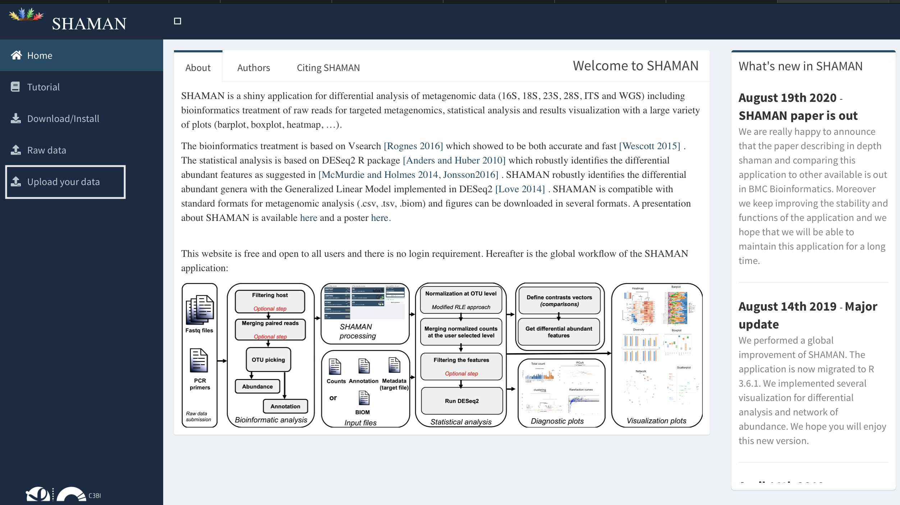
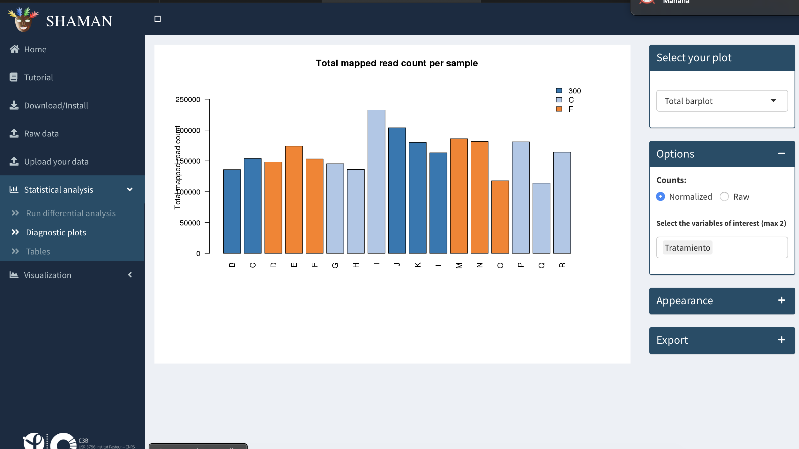

En este documento vamos a ver como subir y procesar las tablas obtenidas
mediante el análisis de metagenomas con dada2 y phyloseq. Para esto
utilizaremos el servidor online Shaman, disponible en la web
<a href="https://shaman.pasteur.fr" class="uri">https://shaman.pasteur.fr</a>

**Requerimientos:**

-   OTU table  

-   taxa table  

-   tabla de metadatos

-   alternativamente puede utilizarse un archivo BIOM

-   estas tablas pueden obtenerse al finalizar el pipeline de análisis
    de ITS

**Importante:** todas las tablas deben estar en formato de texto, con
los valores separados por comas o por tabulaciones.

Iniciamos
=========

Al ingresar a la web que hostea a Shaman nos enfrentaremos a la
siguiente pantalla:

Allí vamos a **Upload your data** en el menú de la izquierda.

Importar los datos a Shaman
===========================

Entraremos en la página de importación de datos, donde utilizaremos los
botones **Browse** para localizar nuestros archivos en el equipo.

 En el caso de que los
datos a analizar se encuentren en un archivo BIOM podemos seleccionar
**BIOM file** en el primer menú desplegable en el panel de la izquierda.

En el panel **Load the count table** seleccionaremos con **Browse** el
archivo que contiene la OTU table y elegimos del menú desplegable los
delimitadores de las columnas. Las opciones disponibles son
tabulaciones, comas (,) y puntos y comas (;).

En el panel **Load the taxonomy file** importaremos la taxa table y
utilizamos el menú desplegable para seleccionar el separador de
columnas.

Si todo está bien, y los datos están en el formato esperado, veremos una
pantalla como la siguiente, donde los rectángulos de arriba se tornan
verdes y aparece una tabla con datos en la parte inferior:

En el caso de que alguno de los archivos no tenga el formato esperado,
los rectángulos azules de arriba se tornan rojos sobre el panel que
presentó problemas.

Vemos que en el menú de la izquierda aparece dos nuevas opciones:
**Statistical Analysis** y **Visualization**. Vamos ahora a
**Statistical Analysis** y ahí **Run differential analysis**.

En el Panel **Experimental design** importamos el archivo con los
metadatos que se obtuvo al final del pipeline de análisis ITS. Elegimos
el separador de las columnas del archivo, el nivel taxonómico y las
variables a utilizar para realizar los análisis estadísticos.

En el panel **Options** seleccionamos los parámetros deseados para el
análisis.

Si la tabla de metadatos se importó correctamente y tiene el formato
esperado, el rectángulo azul de la parte superior se tornará verde, y
prodremor dar inicio al análisis pulsando el botón **Run analisis**.

Luego de un momento, aparecen nuevos paneles en la pantalla que nos
permiten, por ejemplo, seleccionar muestras para realizar contrastes.

En la página **Diagnostic plots** podremos seleccionar variables y
configurar aspectos estéticos de gráficos de diferentes tipos, que
pueden ser seleccionados en el menú desplegable situado arriba a la
derecha, en el panel **Select your plot**. En el panel **Appearance**
seleccionamos opciones estéticas de los gráficos y en el panel
**Export** encontramos funciones que nos permiten exportar los gráficos
en diferentes formatos.

En **Tables** se pueden visualizar los contrastes seleccionados
anteriormente, y si hay taxos diferenciales entre muestras.

Debajo del menú **Tables**, en **Visualization** encontramos dos items
que nos permiten explorar los resultados del análisis. En **Global
views** encontramos diferentes herramientas para visualizar los
resultados, diferentes tipos de plots y selección de variables. Su
disposición es similar al menú anterior:

Finalmente, en **Comparison plots**, podremos visualizar las diferencias
encontradas entre los tratamientos o contrastes seleccionados, si es que
las hubiera.

Conclusiones
------------

En este pequeño tutorial exploramos el uso de Shaman para realizar
análisis estadísticos y visualizar los resultados de metagenomas, a
partir de la importación de tablas que se obtienen comunmente en
softwares de análisis de metagenomas. Hay muchas opciones de
visualización y de análisis en este servidor, por lo cual recomiendo que
lo exploren con sus propios datos o con los datasets de prueba, que
pueden seleccionarse en la pantalla de inicio.

> Este es un tutorial inicial sobre el uso de Shaman, que no suplanta
> los manuales y tutoriales oficiales de la herramienta.

Referencias
===========

-   SHAMAN: a user-friendly website for metataxonomic analysis from raw
    reads to statistical analysis Volant S, Lechat P, Woringer P,
    Motreff L, Campagne P, Malabat C, Kennedy S, Ghozlane A; BMC
    Bioinformatics 2020 Aug 10;21(1):345.  
-   <a href="https://shaman.pasteur.fr" class="uri">https://shaman.pasteur.fr</a>
